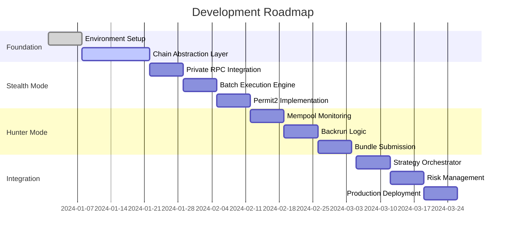

# **Product Requirements Document (PRD) v2.0**

**Project:** Adaptive MEV Defense & Profit Bot

**Author:** Daniel Howard

**Date:** [Current Date]

**Version:** 2.0 - Enhanced with Stealth Strategy

---

## **1. Executive Summary**

### **Mission**

Build a dual-mode MEV bot that operates both offensively (hunting snipers) and defensively (stealth execution), maximizing profit while minimizing exposure to MEV attacks.

### **Core Innovation**

Two complementary strategies:

1. **Hunter Mode**: Detect and backrun sniper bots for profit
2. **Stealth Mode**: Execute trades invisibly to avoid being targeted

### **Target Outcome**

- 80% reduction in MEV losses for stealth trades
- 5-10% daily ROI from hunter operations
- Zero-downtime, self-healing system

---

## **2. Development Strategy**

### **Build Sequence (12-Week Timeline)**



---

## **3. Technical Architecture**

### **System Overview**### **Core Components**

### **3.1 Strategy Engine**

```python
from abc import ABC, abstractmethod
from enum import Enum
from typing import Optional, Dict, Any

class ExecutionMode(Enum):
    STEALTH = "stealth"
    HUNTER = "hunter"
    HYBRID = "hybrid"

class BaseStrategy(ABC):
    @abstractmethod
    async def evaluate(self, context: Dict[str, Any]) -> float:
        """Return profit score 0-1"""
        pass

    @abstractmethod
    async def execute(self, opportunity: Dict[str, Any]) -> TransactionResult:
        pass

class StealthStrategy(BaseStrategy):
    """
    Invisible execution strategy to avoid MEV attacks
    """
    def __init__(self):
        self.private_rpcs = {
            'ethereum': ['flashbots_protect', 'mev_blocker'],
            'polygon': ['polygon_flashbots'],
            'base': ['base_private_pool']
        }
        self.permit2_handler = Permit2Handler()

    async def should_go_stealth(self, trade: Dict) -> bool:
        """Determine if trade should use stealth mode"""
        conditions = [
            trade['estimated_slippage'] > 0.005,  # >0.5% slippage
            trade['token_age_hours'] < 24,        # New token
            trade['liquidity_usd'] < 100000,      # Low liquidity
            trade['is_trending'],                  # High attention
            trade['detected_snipers'] > 0         # Active snipers
        ]
        return sum(conditions) >= 2

    async def execute_stealth_swap(self, params: Dict) -> TransactionResult:
        # 1. Generate Permit2 signature off-chain
        permit_sig = await self.permit2_handler.generate_signature(
            token=params['token_in'],
            amount=params['amount'],
            spender=params['router']
        )

        # 2. Build exact-output swap
        swap_data = self.build_exact_output_swap(
            token_in=params['token_in'],
            token_out=params['token_out'],
            amount_out_exact=params['desired_output'],
            max_amount_in=params['max_input'],
            permit_signature=permit_sig
        )

        # 3. Submit via private RPC
        result = await self.submit_private_transaction(
            rpc=self.select_best_private_rpc(params['chain']),
            tx_data=swap_data,
            max_priority_fee=params['max_priority_fee']
        )

        return result

class HunterStrategy(BaseStrategy):
    """
    Active MEV extraction via backrunning
    """
    def __init__(self):
        self.mempool_monitor = MempoolMonitor()
        self.bundle_builder = BundleBuilder()

    async def detect_sniper_opportunity(self, tx: PendingTransaction) -> Optional[Opportunity]:
        # Pattern matching for sniper detection
        if self.is_sandwich_attempt(tx):
            return self.calculate_backrun_opportunity(tx)
        return None

    async def execute_backrun(self, sniper_tx: Transaction, opportunity: Opportunity):
        # Build atomic bundle
        bundle = self.bundle_builder.create_bundle([
            sniper_tx,  # Let sniper go first
            self.create_backrun_tx(opportunity)  # Our profitable backrun
        ])

        # Submit to builders
        return await self.submit_to_builders(bundle)

```

### **3.2 Risk Management System**

```python
class AdaptiveRiskManager:
    def __init__(self):
        self.performance_history = deque(maxlen=1000)
        self.current_exposure = 0
        self.daily_pnl = 0

    def calculate_position_size(self, opportunity: Opportunity) -> Wei:
        """Kelly Criterion-based position sizing"""
        win_rate = self.calculate_win_rate()
        avg_win = self.calculate_avg_win()
        avg_loss = self.calculate_avg_loss()

        # Kelly formula: f = (p * b - q) / b
        # where p = win_rate, q = 1-p, b = avg_win/avg_loss
        if avg_loss > 0:
            b = avg_win / avg_loss
            kelly_fraction = (win_rate * b - (1 - win_rate)) / b

            # Apply safety factor (never bet full Kelly)
            safe_fraction = kelly_fraction * 0.25

            # Apply constraints
            max_position = min(
                self.available_capital * safe_fraction,
                self.max_position_size,
                opportunity.liquidity * 0.1  # Max 10% of pool liquidity
            )

            return max_position

        return self.min_position_size

    def should_execute(self, trade: Trade) -> bool:
        """Multi-factor go/no-go decision"""
        checks = {
            'daily_loss_limit': self.daily_pnl > -self.max_daily_loss,
            'consecutive_losses': self.consecutive_losses < 5,
            'gas_reasonable': trade.estimated_gas < trade.expected_profit * 0.3,
            'liquidity_sufficient': trade.pool_liquidity > trade.size * 10,
            'risk_score_acceptable': trade.risk_score < 0.7
        }

        return all(checks.values())

```

---

## **4. Stealth Mode Implementation Details**

### **4.1 Private Orderflow Architecture**

```python
class PrivateOrderflowManager:
    """
    Manages submission of transactions through private channels
    """
    def __init__(self):
        self.endpoints = {
            'flashbots_protect': {
                'url': 'https://rpc.flashbots.net',
                'auth': self.load_flashbots_auth(),
                'chain': 'ethereum'
            },
            'mev_blocker': {
                'url': 'https://rpc.mevblocker.io',
                'chain': 'ethereum'
            },
            'cow_protocol': {
                'url': 'https://api.cow.fi/mainnet/api/v1',
                'chain': 'ethereum',
                'type': 'solver'
            }
        }

    async def route_transaction(self, tx: Transaction) -> SubmissionResult:
        """Intelligently route transaction to best private channel"""

        # Determine best route based on transaction characteristics
        if tx.value > ETH(10):  # High value
            return await self.submit_to_flashbots(tx)
        elif tx.token_is_new:  # New token listing
            return await self.submit_to_cow_protocol(tx)
        else:  # Standard trade
            return await self.submit_to_mev_blocker(tx)

    async def submit_with_permit2(self, trade_params: Dict) -> TransactionResult:
        """Execute trade using Permit2 for gasless approvals"""

        # 1. Create Permit2 signature off-chain
        permit = {
            'details': {
                'token': trade_params['token_address'],
                'amount': trade_params['amount'],
                'expiration': int(time.time()) + 3600,
                'nonce': await self.get_nonce()
            },
            'spender': UNISWAP_ROUTER,
            'sigDeadline': int(time.time()) + 300
        }

        signature = self.sign_permit(permit)

        # 2. Bundle permit with swap in single transaction
        multicall_data = self.encode_multicall([
            ('permit2', permit, signature),
            ('exactOutputSingle', trade_params)
        ])

        # 3. Submit privately
        return await self.submit_private_bundle(multicall_data)

```

### **4.2 Exact Output Implementation**

```python
class ExactOutputSwapper:
    """
    Implements exact-output swaps to prevent sandwich attacks
    """

    def build_exact_output_swap(self, params: SwapParams) -> bytes:
        """
        Build swap that specifies exact output amount
        Sandwichers can't manipulate the final received amount
        """

        router_v3 = self.get_router_v3(params.chain)

        # Encode exactOutputSingle call
        swap_data = router_v3.functions.exactOutputSingle({
            'tokenIn': params.token_in,
            'tokenOut': params.token_out,
            'fee': params.pool_fee,  # 500, 3000, or 10000
            'recipient': params.recipient,
            'deadline': params.deadline,
            'amountOut': params.exact_amount_out,  # EXACT amount we want
            'amountInMaximum': params.max_amount_in,  # Maximum we're willing to pay
            'sqrtPriceLimitX96': 0  # No price limit
        }).build_transaction({
            'from': params.sender,
            'gas': params.gas_limit,
            'maxFeePerGas': params.max_fee,
            'maxPriorityFeePerGas': params.priority_fee,
            'nonce': params.nonce
        })

        return swap_data

```

### **4.3 Batch/Solver Integration**

```python
class SolverIntegration:
    """
    Integration with CoW Protocol and other solver networks
    """

    async def submit_to_cow_protocol(self, order: Order) -> OrderResult:
        """
        Submit order to CoW Protocol for solver competition
        No MEV possible as execution happens off-chain
        """

        # Create order with tight parameters
        cow_order = {
            'sellToken': order.sell_token,
            'buyToken': order.buy_token,
            'sellAmount': str(order.sell_amount),
            'buyAmount': str(order.buy_amount_min),
            'validTo': int(time.time()) + 600,
            'appData': self.compute_app_data(),
            'feeAmount': '0',  # Solver pays gas
            'kind': 'sell',  # or 'buy' for exact output
            'partiallyFillable': False,
            'receiver': order.receiver,
            'signature': order.signature,
            'signingScheme': 'eip1271'  # For smart contract wallets
        }

        # Submit to CoW API
        response = await self.http_client.post(
            f"{COW_API}/orders",
            json=cow_order
        )

        return OrderResult(
            order_id=response['uid'],
            status='pending',
            expected_execution=response['expectedExecution']
        )

```

---

## **5. Performance Targets & Metrics**

### **5.1 Key Performance Indicators**

| Metric | Target | Measurement |
| --- | --- | --- |
| **Stealth Mode Success Rate** | >95% | Trades executed without being sandwiched |
| **Hunter Mode Win Rate** | >70% | Profitable backruns / total attempts |
| **Average Execution Time** | <150ms | Detection to execution latency |
| **Daily ROI** | 5-10% | (Daily Profit / Capital Deployed) * 100 |
| **Gas Efficiency** | <20% | Gas Cost / Gross Profit |
| **System Uptime** | >99.9% | Operational time / total time |
| **Capital Efficiency** | >80% | Capital deployed / total capital |

### **5.2 Risk Metrics**

| Risk Metric | Limit | Action |
| --- | --- | --- |
| **Max Position Size** | 5% of capital | Hard stop |
| **Daily Drawdown** | 10% | Pause trading for 24h |
| **Consecutive Losses** | 5 | Switch to conservative mode |
| **Hourly Loss** | 3% | 1-hour cooldown |
| **Slippage Tolerance** | 1% | Use stealth mode |

---

## **6. MVP Implementation Plan**

### **Week 1-2: Foundation**

```python
# Deliverables:
- [ ] Basic project structure with Docker containers
- [ ] Chain abstraction layer for Polygon
- [ ] Simple mempool monitoring
- [ ] Logging infrastructure

# Success Criteria:
- Can detect 100+ pending transactions per minute
- Successfully connects to Polygon RPC
- Logs stored in DuckDB

```

### **Week 3-4: Stealth Mode MVP**

```python
# Deliverables:
- [ ] Flashbots Protect integration
- [ ] Exact-output swap implementation
- [ ] Basic Permit2 handler
- [ ] Private transaction submission

# Success Criteria:
- Execute 10 trades via private mempool
- Zero sandwiched transactions
- Gas cost < 0.5% of trade value

```

### **Week 5-6: Hunter Mode MVP**

```python
# Deliverables:
- [ ] Sniper detection algorithm
- [ ] Backrun opportunity calculator
- [ ] Bundle builder
- [ ] Builder submission logic

# Success Criteria:
- Detect 50+ sniper transactions
- Successfully backrun 5 transactions
- Positive P&L on testnet

```

### **Week 7-8: Integration & Testing**

```python
# Deliverables:
- [ ] Strategy orchestrator
- [ ] Risk management system
- [ ] Performance monitoring
- [ ] Emergency shutdown

# Success Criteria:
- Both strategies working together
- Risk limits enforced
- Dashboard showing real-time metrics
- 48 hours continuous operation

```

---

## **7. Monitoring & Operations**

### **7.1 Dashboard Requirements**

### **7.2 Alert System**

```python
class AlertManager:
    def __init__(self):
        self.discord_webhook = os.getenv('DISCORD_WEBHOOK')
        self.alert_thresholds = {
            'critical': {
                'daily_loss': -1000,
                'consecutive_losses': 5,
                'system_error': True
            },
            'warning': {
                'gas_spike': 200,  # gwei
                'low_success_rate': 0.6,
                'high_slippage': 0.02
            },
            'info': {
                'large_profit': 500,
                'new_strategy_activated': True,
                'milestone_reached': True
            }
        }

    async def send_alert(self, level: str, message: str, data: Dict = None):
        """Send alert to Discord with rich embed"""

        colors = {
            'critical': 0xFF0000,  # Red
            'warning': 0xFFFF00,   # Yellow
            'info': 0x00FF00,      # Green
            'success': 0x00FF88    # Mint
        }

        embed = {
            "title": f"🤖 MEV Bot Alert - {level.upper()}",
            "description": message,
            "color": colors.get(level, 0x808080),
            "timestamp": datetime.utcnow().isoformat(),
            "fields": []
        }

        if data:
            for key, value in data.items():
                embed["fields"].append({
                    "name": key.replace('_', ' ').title(),
                    "value": str(value),
                    "inline": True
                })

        await self.send_discord_webhook(embed)

```

---

## **8. Security Implementation**

### **8.1 Key Management**

```python
class SecureKeyManager:
    def __init__(self):
        self.use_hardware_wallet = os.getenv('USE_HARDWARE_WALLET', 'false').lower() == 'true'
        self.keys = {}

    async def initialize(self):
        """Initialize key management system"""
        if self.use_hardware_wallet:
            # Hardware wallet integration (future)
            self.wallet = await self.connect_ledger()
        else:
            # Software key management for MVP
            self.load_encrypted_keys()

    def load_encrypted_keys(self):
        """Load and decrypt private keys from secure storage"""
        key_file = Path('.keys/encrypted_keys.json')
        if not key_file.exists():
            raise SecurityError("No keys found")

        # Use environment variable for decryption password
        password = os.getenv('KEY_PASSWORD')
        if not password:
            raise SecurityError("No decryption password provided")

        with open(key_file, 'rb') as f:
            encrypted_data = f.read()

        # Decrypt using Fernet
        fernet = Fernet(self.derive_key(password))
        decrypted = fernet.decrypt(encrypted_data)

        self.keys = json.loads(decrypted)

    async def sign_transaction(self, tx: Dict, chain: str) -> str:
        """Sign transaction with appropriate key"""
        private_key = self.keys.get(f'{chain}_private_key')
        if not private_key:
            raise SecurityError(f"No key for chain: {chain}")

        # Sign transaction
        signed = Account.sign_transaction(tx, private_key)
        return signed.rawTransaction.hex()

```

### **8.2 Access Control**

```python
class AccessControl:
    def __init__(self):
        self.authorized_ips = set(os.getenv('AUTHORIZED_IPS', '').split(','))
        self.api_keys = {}
        self.rate_limiter = RateLimiter()

    def authenticate_request(self, request: Request) -> bool:
        """Multi-factor authentication for API requests"""

        # Check IP whitelist
        if request.client.host not in self.authorized_ips:
            return False

        # Check API key
        api_key = request.headers.get('X-API-Key')
        if not self.validate_api_key(api_key):
            return False

        # Check rate limits
        if not self.rate_limiter.check(api_key):
            return False

        return True

    def validate_api_key(self, key: str) -> bool:
        """Validate API key with expiration check"""
        if key not in self.api_keys:
            return False

        key_data = self.api_keys[key]
        if datetime.now() > key_data['expires']:
            return False

        return True

```

---

## **9. Testing & Validation**

### **9.1 Test Suite Structure**

```python
# tests/test_stealth_strategy.py
import pytest
from unittest.mock import Mock, patch
import asyncio

class TestStealthStrategy:
    @pytest.fixture
    def stealth_strategy(self):
        return StealthStrategy()

    @pytest.mark.asyncio
    async def test_should_go_stealth_high_slippage(self, stealth_strategy):
        """Test stealth mode activation on high slippage"""
        trade = {
            'estimated_slippage': 0.02,  # 2% slippage
            'token_age_hours': 48,
            'liquidity_usd': 500000,
            'is_trending': False,
            'detected_snipers': 0
        }

        result = await stealth_strategy.should_go_stealth(trade)
        assert result == True, "Should activate stealth mode for high slippage"

    @pytest.mark.asyncio
    async def test_permit2_signature_generation(self, stealth_strategy):
        """Test Permit2 signature generation"""
        with patch.object(stealth_strategy.permit2_handler, 'generate_signature') as mock_sign:
            mock_sign.return_value = '0xabcd...'

            params = {
                'token_in': '0xA0b86991c6218b36c1d19D4a2e9Eb0cE3606eB48',
                'amount': 1000000000,
                'router': '0x68b3465833fb72A70ecDF485E0e4C7bD8665Fc45'
            }

            signature = await stealth_strategy.permit2_handler.generate_signature(
                token=params['token_in'],
                amount=params['amount'],
                spender=params['router']
            )

            assert signature.startswith('0x'), "Signature should be hex string"

# tests/test_risk_management.py
class TestRiskManagement:
    def test_kelly_criterion_position_sizing(self):
        """Test position sizing using Kelly Criterion"""
        risk_manager = AdaptiveRiskManager()
        risk_manager.performance_history = [
            {'profit': 100, 'result': 'win'},
            {'profit': -50, 'result': 'loss'},
            {'profit': 150, 'result': 'win'},
            {'profit': 200, 'result': 'win'},
            {'profit': -40, 'result': 'loss'}
        ]

        opportunity = Mock(liquidity=1000000)
        risk_manager.available_capital = 10000
        risk_manager.max_position_size = 1000

        position_size = risk_manager.calculate_position_size(opportunity)

        # With 60% win rate and 2:1 win/loss ratio
        # Kelly fraction = (0.6 * 2 - 0.4) / 2 = 0.4
        # With safety factor 0.25: 0.4 * 0.25 = 0.1
        # Position = 10000 * 0.1 = 1000

        assert position_size <= 1000, "Should not exceed max position size"
        assert position_size > 0, "Should have positive position size"

```

### **9.2 Integration Testing**

```python
class IntegrationTest:
    async def test_full_stealth_flow(self):
        """End-to-end test of stealth execution"""

        # Setup test environment
        test_env = await TestEnvironment.create(
            chain='polygon',
            fork_block='latest'
        )

        # Deploy test contracts
        test_token = await test_env.deploy_token(
            name="TestToken",
            supply=1000000
        )

        # Create liquidity pool
        await test_env.create_pool(
            token_a=test_token,
            token_b=USDC,
            liquidity_a=100000,
            liquidity_b=100000
        )

        # Initialize bot
        bot = MEVBot(config=test_config)
        await bot.initialize()

        # Create trade opportunity
        trade = {
            'token_in': USDC,
            'token_out': test_token,
            'amount_in': 1000,
            'estimated_slippage': 0.015,  # Will trigger stealth mode
            'detected_snipers': 2
        }

        # Execute trade
        result = await bot.execute_trade(trade)

        # Verify results
        assert result.mode == 'stealth'
        assert result.success == True
        assert result.slippage < 0.005  # Should be protected
        assert result.sandwiched == False

```

---

## **10. Deployment & Operations**

### **10.1 Docker Compose Configuration**

```yaml
# docker-compose.yml
version: '3.8'

services:
  mev-bot:
    build: ./bot
    container_name: mev-bot-core
    environment:
      - CHAIN=polygon
      - MODE=production
      - USE_PRIVATE_RPC=true
    volumes:
      - ./config:/app/config
      - ./logs:/app/logs
    restart: unless-stopped
    depends_on:
      - redis
      - postgres
    networks:
      - mev-network

  redis:
    image: redis:7-alpine
    container_name: mev-redis
    ports:
      - "6379:6379"
    volumes:
      - redis-data:/data
    networks:
      - mev-network

  postgres:
    image: postgres:15
    container_name: mev-db
    environment:
      - POSTGRES_DB=mev_bot
      - POSTGRES_USER=mev_user
      - POSTGRES_PASSWORD=${DB_PASSWORD}
    volumes:
      - postgres-data:/var/lib/postgresql/data
    networks:
      - mev-network

  grafana:
    image: grafana/grafana:latest
    container_name: mev-grafana
    ports:
      - "3000:3000"
    environment:
      - GF_SECURITY_ADMIN_PASSWORD=${GRAFANA_PASSWORD}
    volumes:
      - grafana-data:/var/lib/grafana
      - ./grafana/dashboards:/etc/grafana/provisioning/dashboards
    networks:
      - mev-network

  prometheus:
    image: prom/prometheus:latest
    container_name: mev-prometheus
    ports:
      - "9090:9090"
    volumes:
      - ./prometheus/prometheus.yml:/etc/prometheus/prometheus.yml
      - prometheus-data:/prometheus
    networks:
      - mev-network

networks:
  mev-network:
    driver: bridge

volumes:
  redis-data:
  postgres-data:
  grafana-data:
  prometheus-data:

```

### *10.2 Production

### **10.2 Production Deployment Checklist**

```python
# deployment/production_checklist.py

class ProductionDeployment:
    """
    Production deployment validator and orchestrator
    """

    def __init__(self):
        self.checks = []
        self.warnings = []
        self.errors = []

    async def pre_deployment_checks(self) -> bool:
        """Run all pre-deployment validation"""

        checks = [
            self.check_environment_variables(),
            self.check_rpc_endpoints(),
            self.check_private_keys(),
            self.check_database_connectivity(),
            self.check_monitoring_setup(),
            self.check_risk_limits(),
            self.check_backup_systems(),
            self.check_emergency_procedures()
        ]

        results = await asyncio.gather(*checks)
        return all(results)

    async def check_environment_variables(self) -> bool:
        """Validate all required environment variables"""
        required_vars = [
            'CHAIN_ID',
            'RPC_ENDPOINT_PRIMARY',
            'RPC_ENDPOINT_BACKUP',
            'FLASHBOTS_RELAY_URL',
            'PRIVATE_KEY_ENCRYPTED',
            'KEY_PASSWORD',
            'DISCORD_WEBHOOK',
            'MAX_DAILY_LOSS',
            'MAX_POSITION_SIZE'
        ]

        missing = []
        for var in required_vars:
            if not os.getenv(var):
                missing.append(var)
                self.errors.append(f"Missing required env var: {var}")

        return len(missing) == 0

    async def check_rpc_endpoints(self) -> bool:
        """Test RPC endpoint connectivity and latency"""
        endpoints = [
            os.getenv('RPC_ENDPOINT_PRIMARY'),
            os.getenv('RPC_ENDPOINT_BACKUP')
        ]

        for endpoint in endpoints:
            try:
                w3 = Web3(HTTPProvider(endpoint))

                # Test basic connectivity
                if not w3.isConnected():
                    self.errors.append(f"Cannot connect to RPC: {endpoint}")
                    return False

                # Test latency
                start = time.time()
                block = w3.eth.get_block('latest')
                latency = (time.time() - start) * 1000

                if latency > 100:  # >100ms is too slow
                    self.warnings.append(f"High RPC latency: {latency:.0f}ms for {endpoint}")

                # Test mempool access
                try:
                    pending = w3.eth.get_block('pending', full_transactions=True)
                    if len(pending.transactions) == 0:
                        self.warnings.append(f"No pending transactions visible on {endpoint}")
                except:
                    self.errors.append(f"Cannot access mempool on {endpoint}")

            except Exception as e:
                self.errors.append(f"RPC check failed: {str(e)}")
                return False

        return True

    async def validate_strategy_configs(self) -> bool:
        """Validate strategy configuration files"""
        config_path = Path('./config/strategies.yaml')

        if not config_path.exists():
            self.errors.append("Strategy config file not found")
            return False

        with open(config_path) as f:
            config = yaml.safe_load(f)

        # Validate stealth strategy config
        stealth = config.get('stealth_strategy', {})
        if not stealth.get('private_rpcs'):
            self.errors.append("No private RPCs configured for stealth mode")
            return False

        if stealth.get('max_slippage', 1.0) > 0.02:
            self.warnings.append("High max slippage configured for stealth mode")

        # Validate hunter strategy config
        hunter = config.get('hunter_strategy', {})
        if hunter.get('min_profit_wei', 0) < 100000000000000:  # 0.0001 ETH
            self.warnings.append("Very low minimum profit threshold")

        return True

```

### **10.3 Deployment Script**

```bash
#!/bin/bash
# deploy.sh - Production deployment script

set -e  # Exit on error

echo "🚀 MEV Bot Production Deployment"
echo "================================"

# Load environment
source .env.production

# Run pre-deployment checks
echo "📋 Running pre-deployment checks..."
python3 deployment/production_checklist.py
if [ $? -ne 0 ]; then
    echo "❌ Pre-deployment checks failed"
    exit 1
fi

# Backup current deployment
echo "💾 Backing up current deployment..."
docker-compose down
tar -czf backups/backup-$(date +%Y%m%d-%H%M%S).tar.gz \
    config/ \
    logs/ \
    data/

# Pull latest code
echo "📥 Pulling latest code..."
git pull origin main
git submodule update --init --recursive

# Build containers
echo "🔨 Building containers..."
docker-compose build --no-cache

# Run database migrations
echo "🗄️ Running database migrations..."
docker-compose run --rm mev-bot python manage.py migrate

# Start services
echo "🚀 Starting services..."
docker-compose up -d

# Wait for services to be healthy
echo "⏳ Waiting for services..."
sleep 10

# Run smoke tests
echo "🧪 Running smoke tests..."
python3 tests/smoke_tests.py

# Check service health
echo "❤️ Checking service health..."
docker-compose ps
curl -f http://localhost:8000/health || exit 1

echo "✅ Deployment successful!"
echo ""
echo "📊 Dashboard: http://localhost:3000"
echo "📈 Prometheus: http://localhost:9090"
echo "🤖 API: http://localhost:8000"

```

---

## **11. Operational Procedures**

### **11.1 Daily Operations Runbook**

```markdown
# Daily Operations Runbook

## Morning Checklist (9:00 AM UTC)
- [ ] Check overnight P&L
- [ ] Review any critical alerts
- [ ] Verify all strategies are active
- [ ] Check gas prices and adjust limits if needed
- [ ] Review competitor activity (new bots, strategies)
- [ ] Check for any failed transactions
- [ ] Verify backup systems are operational

## Continuous Monitoring
- Monitor Discord alerts channel
- Check Grafana dashboard every 2 hours
- Review large trades (>$1000 profit/loss)
- Monitor gas spikes
- Track success rates

## End of Day (21:00 UTC)
- [ ] Calculate daily P&L
- [ ] Archive logs to NAS
- [ ] Review strategy performance metrics
- [ ] Identify optimization opportunities
- [ ] Update risk limits if needed
- [ ] Backup configuration changes

```

### **11.2 Emergency Procedures**

```python
class EmergencyHandler:
    """
    Emergency response system for critical events
    """

    def __init__(self):
        self.emergency_mode = False
        self.pause_reasons = []

    async def emergency_stop(self, reason: str):
        """Immediately stop all trading activity"""

        self.emergency_mode = True
        self.pause_reasons.append({
            'timestamp': datetime.utcnow(),
            'reason': reason
        })

        # 1. Cancel all pending transactions
        await self.cancel_all_pending()

        # 2. Stop all strategy execution
        await self.stop_all_strategies()

        # 3. Withdraw funds to safe address (optional)
        if 'HACK' in reason.upper() or 'EXPLOIT' in reason.upper():
            await self.emergency_withdraw()

        # 4. Alert team
        await self.alert_emergency_contacts(reason)

        # 5. Log everything
        await self.create_incident_report(reason)

    async def recovery_procedure(self):
        """Steps to recover from emergency stop"""

        if not self.emergency_mode:
            return "System not in emergency mode"

        recovery_steps = [
            "1. Identify root cause from logs",
            "2. Fix identified issues",
            "3. Run test suite on testnet",
            "4. Gradually resume with reduced limits",
            "5. Monitor closely for 24 hours",
            "6. Return to normal operations if stable"
        ]

        return recovery_steps

```

---

## **12. Performance Optimization**

### **12.1 Latency Optimization**

```python
class LatencyOptimizer:
    """
    Optimize execution speed for competitive advantage
    """

    def __init__(self):
        self.latency_targets = {
            'mempool_detection': 10,   # ms
            'opportunity_analysis': 20, # ms
            'simulation': 50,          # ms
            'execution': 30,           # ms
            'total': 100              # ms
        }

    async def optimize_mempool_monitoring(self):
        """Use multiple WebSocket connections for redundancy and speed"""

        connections = []
        endpoints = [
            'wss://mainnet.infura.io/ws/v3/KEY',
            'wss://eth-mainnet.g.alchemy.com/v2/KEY',
            'wss://rpc.ankr.com/eth_ws/KEY'
        ]

        for endpoint in endpoints:
            ws = await websockets.connect(endpoint)
            await ws.send(json.dumps({
                "jsonrpc": "2.0",
                "id": 1,
                "method": "eth_subscribe",
                "params": ["newPendingTransactions"]
            }))
            connections.append(ws)

        # Process from fastest connection
        while True:
            # Race all connections
            done, pending = await asyncio.wait(
                [ws.recv() for ws in connections],
                return_when=asyncio.FIRST_COMPLETED
            )

            # Process first result
            for task in done:
                tx_hash = task.result()
                await self.process_transaction(tx_hash)

            # Cancel slower connections
            for task in pending:
                task.cancel()

    def optimize_transaction_processing(self):
        """Use Rust for critical path processing"""

        # Rust module for fast processing
        rust_code = """
        use ethers::types::{Transaction, H256};
        use std::collections::HashMap;

        #[no_mangle]
        pub extern "C" fn is_profitable_opportunity(
            tx_data: *const u8,
            tx_len: usize,
            min_profit: u64
        ) -> bool {
            // Decode transaction
            let tx = decode_transaction(tx_data, tx_len);

            // Quick filters
            if !is_dex_interaction(&tx) {
                return false;
            }

            // Fast profit calculation
            let estimated_profit = calculate_profit(&tx);

            estimated_profit > min_profit
        }
        """

```

### **12.2 Strategy Optimization**

```python
class StrategyOptimizer:
    """
    ML-based strategy optimization
    """

    def __init__(self):
        self.model = self.load_or_create_model()
        self.feature_extractor = FeatureExtractor()

    async def optimize_strategy_selection(self, market_state: Dict) -> str:
        """Use ML to select best strategy for current conditions"""

        # Extract features
        features = self.feature_extractor.extract({
            'gas_price': market_state['gas_price'],
            'volatility': market_state['volatility'],
            'volume': market_state['volume_24h'],
            'active_snipers': market_state['detected_snipers'],
            'time_of_day': datetime.now().hour,
            'day_of_week': datetime.now().weekday()
        })

        # Predict best strategy
        prediction = self.model.predict(features)

        strategy_map = {
            0: 'stealth',
            1: 'hunter',
            2: 'hybrid'
        }

        return strategy_map[prediction]

    def train_model(self, historical_data: pd.DataFrame):
        """Train strategy selection model on historical performance"""

        from sklearn.ensemble import RandomForestClassifier
        from sklearn.model_selection import train_test_split

        # Prepare features and labels
        X = historical_data[['gas_price', 'volatility', 'volume',
                            'active_snipers', 'hour', 'weekday']]
        y = historical_data['best_strategy']  # Which strategy performed best

        # Split data
        X_train, X_test, y_train, y_test = train_test_split(
            X, y, test_size=0.2, random_state=42
        )

        # Train model
        self.model = RandomForestClassifier(n_estimators=100)
        self.model.fit(X_train, y_train)

        # Evaluate
        accuracy = self.model.score(X_test, y_test)
        print(f"Model accuracy: {accuracy:.2%}")

        return self.model

```

---

## **13. Continuous Improvement Framework**

### **13.1 A/B Testing System**

```python
class ABTestingFramework:
    """
    Test strategy variations in production
    """

    def __init__(self):
        self.active_tests = {}
        self.results = defaultdict(list)

    async def run_ab_test(self, test_config: Dict):
        """Run A/B test on strategy parameters"""

        test_id = str(uuid.uuid4())
        self.active_tests[test_id] = {
            'name': test_config['name'],
            'start_time': datetime.utcnow(),
            'variant_a': test_config['control'],
            'variant_b': test_config['treatment'],
            'traffic_split': test_config.get('split', 0.5)
        }

        # Run test for specified duration
        duration = test_config.get('duration_hours', 24)
        end_time = datetime.utcnow() + timedelta(hours=duration)

        while datetime.utcnow() < end_time:
            # Randomly assign to variant
            use_variant_b = random.random() < test_config['split']

            if use_variant_b:
                result = await self.execute_variant(
                    test_config['treatment']
                )
                self.results[f"{test_id}_b"].append(result)
            else:
                result = await self.execute_variant(
                    test_config['control']
                )
                self.results[f"{test_id}_a"].append(result)

            await asyncio.sleep(1)

        # Analyze results
        return self.analyze_test_results(test_id)

    def analyze_test_results(self, test_id: str) -> Dict:
        """Statistical analysis of A/B test results"""

        from scipy import stats

        results_a = self.results[f"{test_id}_a"]
        results_b = self.results[f"{test_id}_b"]

        # Calculate metrics
        profit_a = sum(r['profit'] for r in results_a)
        profit_b = sum(r['profit'] for r in results_b)

        win_rate_a = sum(1 for r in results_a if r['profit'] > 0) / len(results_a)
        win_rate_b = sum(1 for r in results_b if r['profit'] > 0) / len(results_b)

        # Statistical significance
        t_stat, p_value = stats.ttest_ind(
            [r['profit'] for r in results_a],
            [r['profit'] for r in results_b]
        )

        return {
            'variant_a': {
                'total_profit': profit_a,
                'win_rate': win_rate_a,
                'trades': len(results_a)
            },
            'variant_b': {
                'total_profit': profit_b,
                'win_rate': win_rate_b,
                'trades': len(results_b)
            },
            'statistical_significance': p_value < 0.05,
            'p_value': p_value,
            'recommendation': 'B' if profit_b > profit_a and p_value < 0.05 else 'A'
        }

```

### **13.2 Performance Analytics**

```python
class PerformanceAnalytics:
    """
    Deep analytics for strategy optimization
    """

    def __init__(self):
        self.db = DuckDB('analytics.db')

    async def generate_weekly_report(self) -> Dict:
        """Generate comprehensive weekly performance report"""

        report = {
            'generated_at': datetime.utcnow().isoformat(),
            'period': 'weekly',
            'summary': {},
            'strategies': {},
            'opportunities': {},
            'recommendations': []
        }

        # Overall performance
        report['summary'] = {
            'total_profit': self.calculate_total_profit(),
            'roi': self.calculate_roi(),
            'win_rate': self.calculate_win_rate(),
            'total_trades': self.count_trades(),
            'gas_spent': self.calculate_gas_spent(),
            'best_day': self.find_best_day(),
            'worst_day': self.find_worst_day()
        }

        # Per-strategy analysis
        for strategy in ['stealth', 'hunter']:
            report['strategies'][strategy] = {
                'profit': self.calculate_strategy_profit(strategy),
                'trades': self.count_strategy_trades(strategy),
                'win_rate': self.calculate_strategy_win_rate(strategy),
                'avg_profit': self.calculate_avg_profit(strategy),
                'best_trade': self.find_best_trade(strategy),
                'worst_trade': self.find_worst_trade(strategy)
            }

        # Missed opportunities
        report['opportunities'] = {
            'missed_count': self.count_missed_opportunities(),
            'estimated_missed_profit': self.calculate_missed_profit(),
            'reasons': self.analyze_miss_reasons()
        }

        # Generate recommendations
        report['recommendations'] = self.generate_recommendations(report)

        return report

    def generate_recommendations(self, report: Dict) -> List[str]:
        """Generate actionable recommendations from analytics"""

        recommendations = []

        # Check win rate
        if report['summary']['win_rate'] < 0.6:
            recommendations.append(
                "Win rate below 60% - consider tightening opportunity filters"
            )

        # Check gas efficiency
        gas_ratio = report['summary']['gas_spent'] / report['summary']['total_profit']
        if gas_ratio > 0.2:
            recommendations.append(
                f"High gas costs ({gas_ratio:.1%} of profit) - prioritize low-fee chains"
            )

        # Strategy performance
        if report['strategies']['stealth']['win_rate'] > report['strategies']['hunter']['win_rate']:
            recommendations.append(
                "Stealth mode outperforming Hunter - consider increasing stealth allocation"
            )

        # Missed opportunities
        if report['opportunities']['missed_count'] > 100:
            recommendations.append(
                "High missed opportunity count - consider increasing capital or position limits"
            )

        return recommendations

```

---

## **14. Conclusion & Next Steps**

### **14.1 Implementation Priorities**

1. **Week 1-2:** Foundation + Stealth Mode MVP
2. **Week 3-4:** Hunter Mode MVP
3. **Week 5-6:** Integration & Risk Management
4. **Week 7-8:** Testing & Optimization
5. **Week 9-10:** Production Deployment
6. **Week 11-12:** Performance Tuning & Scaling

### **14.2 Success Metrics (3-Month Targets)**

- ✅ **Stealth Mode:** 95%+ success rate avoiding sandwiches
- ✅ **Hunter Mode:** 70%+ win rate on backruns
- ✅ **Daily ROI:** 5-10% consistent returns
- ✅ **System Uptime:** 99.9%+ availability
- ✅ **Risk Management:** Zero catastrophic losses
- ✅ **Latency:** <100ms detection-to-execution

### **14.3 Future Enhancements**

1. **Cross-chain Arbitrage:** Expand to bridge opportunities
2. **ML Strategy Selection:** Deep learning for optimal strategy choice
3. **Hardware Wallet Integration:** Enhanced security
4. **Custom Builder Relationships:** Direct builder connections
5. **Advanced MEV Strategies:** JIT liquidity, liquidations
6. **Institutional Features:** Multi-sig, audit logs, compliance

---

## **Final Notes**

This enhanced PRD provides a complete blueprint for building a sophisticated dual-mode MEV bot that can both hunt for profits and protect against attacks. The stealth mode implementation is particularly valuable for:

- **New token launches** where slippage is high
- **Large trades** that would normally be sandwich targets
- **Volatile markets** where MEV activity is intense
- **Privacy-conscious trading** where transaction details should remain hidden

The combination of offensive (hunter) and defensive (stealth) strategies creates a robust system that can adapt to any market condition while maintaining consistent profitability.

**Remember:** Start simple, test thoroughly, and scale gradually. The MEV landscape is competitive and constantly evolving, so continuous monitoring and adaptation are essential for long-term success.
